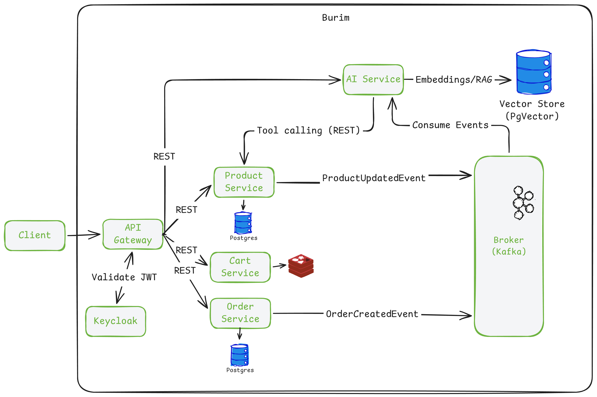

# Burim

> AI-powered marketplace built with Java & Spring.

🚧 **Work in progress**

Burim is a microservice-based e-commerce platform with AI-assisted
product discovery, comparison and seller tools.

## ✨ What makes Burim different?

- 🤖 AI-powered product comparison
- 💬 Questions about product reviews using RAG
- 🏷️ AI-assisted product listing for sellers
- 💰 AI-powered price recommendations
- 🔎 Tool Calling for live marketplace data
- 📚 RAG over reviews and marketplace documentation

## 🏗️ Architecture

Burim uses independent services with database-per-service isolation.

| Service | Responsibility |
|---|---|
| **API Gateway** | Entry point and request routing |
| **Product Service** | Products, categories, inventory and reviews |
| **Cart Service** | Shopping cart |
| **Order Service** | Orders and order status |
| **AI Service** | LLM integration, Tool Calling and RAG |

### Communication

- **REST** — synchronous requests requiring an immediate response
- **Kafka** — asynchronous domain events and background processing
- **Redis** — cart state
- **PostgreSQL** — persistent service data
- **PGVector** — vector embeddings and semantic search

## 🤖 AI

The AI Service is built around Spring AI.

**Tool Calling**

AI can request live marketplace data through tools exposed by
the Product Service.

**RAG**

Two knowledge sources are planned:

- product reviews
- marketplace documentation

This enables queries such as:

> "What do customers complain about most in this laptop?"

> "Compare these three products based on their reviews."

## 📐 Use Cases

## 🛠️ Tech Stack

**Backend**

Java 21 · Spring Boot · Spring Cloud · Spring Data JPA · Hibernate · Flyway

**Data & Messaging**

PostgreSQL · Redis · Apache Kafka · PGVector

**AI**

Spring AI · RAG · Function Calling

**Security & Observability**

Keycloak · Actuator · Prometheus · Grafana · Zipkin · Resilience4j

**Infrastructure**

Docker · Docker Compose

## 🚧 Project Status

Currently implementing the **Product Service**.

The remaining services and AI capabilities will be added incrementally.