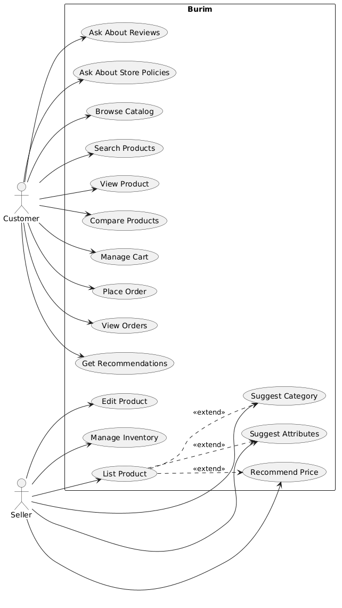

## Use Case Diagram

Burim supports two main user roles: customers and sellers. The diagram shows their core interactions with the platform and the available AI-assisted features.

## Tech Stack

### Backend
- Java 21
- Spring Boot
- Spring Cloud

### Data & Messaging
- PostgreSQL
- Redis
- Apache Kafka

### Security
- Keycloak

### AI
- Spring AI
- RAG
- Function Calling

### Observability
- Actuator
- Prometheus
- Grafana
- Zipkin
- Resilience4j

### Infrastructure
- Docker

🚧 Work in progress
